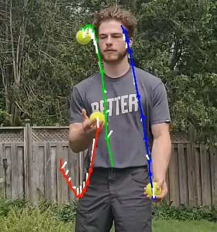

# Traccc

|||
|---|---|
|||

A tool to track sports balls, and add interesting visual effects. 

test :juggling_person:
test :fire:

Running this project is fairly demanding.
A GPU is very helpful for running the neural networks for ball detection quickly, but it isn't required.
At minimum: **10GB** disk space.

# :fire: Application Quickstart :fire:

For Windows users, see the [Windows Installation Guide](docs/install_windows.md).
For MacOS users, see the [MacOS Installation Guide](docs/install_macos.md).

After installation, you can refer to the [User Guide](docs/user_guide.md) for an
overview of all the software has to offer.


## The CLI pipeline

This project also features a full command line interface (CLI). This can be used
inside the running docker container.
Before starting the pipeline, determine a _name_ for your project. For the following
examples, I'll be using `yellowball`

### 1. **Detect** all the sports balls in the video, frame by frame

```
py3 detect.py yellowball 
```

### 2. **Track** the sports balls through sequential frames, using the detections

```
py3 track.py yellowball 
```

###  3. **Visualize** the motion of the balls, using the tracks

```
py3 draw.py yellowball --effect red_dot
```

All of the above commands will have multiple options. You can see what the options
do using the `-h` (help) option, such as:
```
py3 detect.py -h
```

---

## Contributing

Contributions are welcome! Open an issue or a pull request, and I'll get to it when I can.
Adding new effects is an easy contribution to make.

### TODO

- [ ] Custom train a NN for sports balls only.
- [ ] Video "upload" and download in the GUI.
