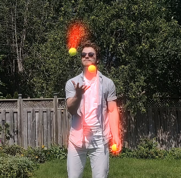

# Traccc

|||
|---|---|
|||

A command line interface tool to track sports balls, and add interesting visual effects. 

Running this project is fairly demanding.
A GPU is very helpful for running the neural networks for ball detection quickly.
At minimum: **5GB** disk space.

# :fire: Application quickstart :fire:

This application uses [docker](www.docker.com).
Docker should be installed, and following that the command:
```
docker build -t balltracking .
```
From the top-level directory.

From there, the docker container needs to be spun up from the image, which is
accomplished by the script:

```
bash start_linux.sh
```

A Windows version of this script is a work in progress.

## The pipeline

before starting the pipeline, determine a _name_ for your project. For the following
examples, I'll be using `yellowball`

### 1. **Detect** all the sports balls in the video, frame by frame

```
py3 detect.py yellowball 
```

### 2. **Track** the sports balls through sequential frames, using the detections

```
py3 track.py yellowball 
```

###  3. **Visualize** the motion of the balls, using the tracks

```
py3 draw.py yellowball --effect red_dot
```

All of the above commands will have multiple options. You can see what the options
do using the `-h` (help) option, such as:
```
py3 detect.py -h
```

---

## Best Practices:

1. Use a **high framerate**. Most cameras can shoot 60fps now, go as high as you can.
Every frame is additional information for the tracker, so it's better able to track the balls.
2. Use a **fast shutter speed**. This is usually implied by high framerate, but technically different.
A fast shutter speed will **reduce motion blur**, making the balls in every frame look more like balls 
and thus making them easier to detect.
3. Expose for the balls. If the exposure of the camera is too high or too low, the balls will lose detail
and they'll be almost impossible to detect, because they won't look like balls. Even lighting is best,
so the camera doesn't have to expose for the highlights or the shadows.
4. Use a **small file to test ideas**. Some of the effects and detections are very slow to run,
especially without a GPU. It's best to test and tweak an effect on a short clip, iterate fast, and then
apply it to a longer clip once you're sure you have what you want.

## Contributing

Contributions are welcome! Open an issue or a pull request, and I'll get to it when I can.
Adding new effects is an easy contribution to make.

### TODO

- [ ] make a debug effect that displays measurements, tracks, and their states.
