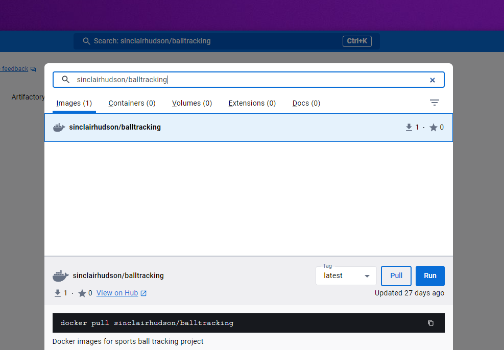
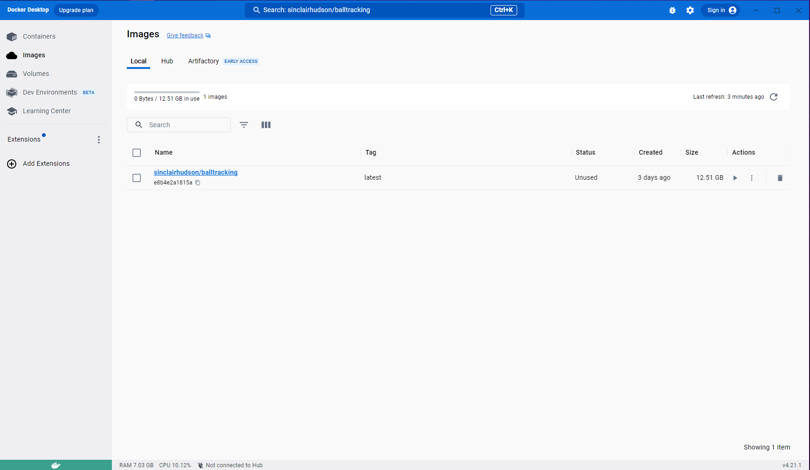
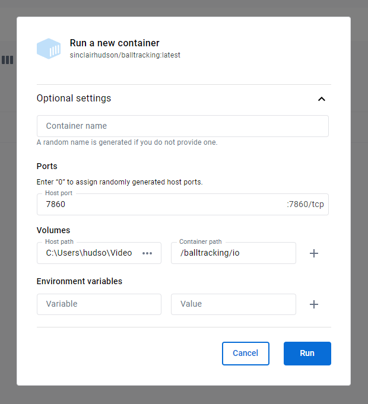
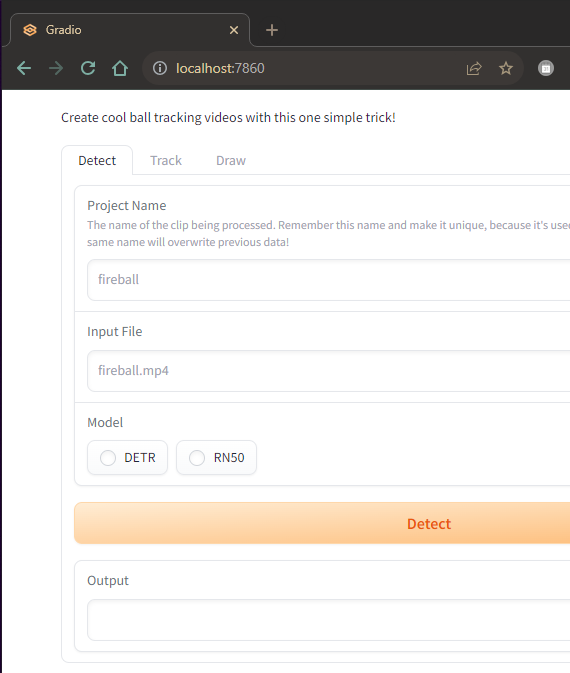

# Windows installation guide

1. Install [Docker Desktop](https://docs.docker.com/desktop/install/windows-install/)

Docker is an application that allows virtualization, sort of like a virtual machine.
This application only runs natively on the Linux operating system, but Docker allows it
to run on all operating systems (like Windows and MacOS). It's possible that after
installing the application, it will ask you to change some settings in your bios.
This may seem daunting but it's not that hard. Unfortunately, the process is motherboard-specific,
so it's hard to write an in-depth guide.

This is the hardest step; installing Docker can be a pain.

---

2. Pull the docker image 
Use the docker desktop app to download the docker image `sinclairhudson/balltracking:latest`.
This is a version of the app posted to Docker Hub.
Search for the image in the top search bar of Docker Desktop, and "pull" (download) it from Docker Hub.

You should see the image appear in the "Images" tab of Docker Desktop:

---

3. Run the docker image with options
There are two things that need to be done: port access and file system access for input and outputs.

---

4. Verify
Wait a few seconds after clicking "run", and then open your browser and go to `localhost:7860`.
If everything is working, then you should see the GUI in the browser. 

---

Head over to the [User Guide](user_guide.md) for guidance on how to use the app!

If you're not seeing the GUI, check that you ran the docker image with the correct options.
When it's running, you can also check the "logs" tab in docker desktop to see if it's giving an
error message. If you think there's something wrong, please open an issue on the GitHub page.
