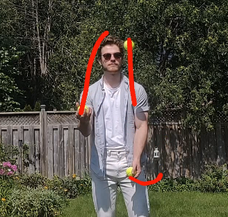
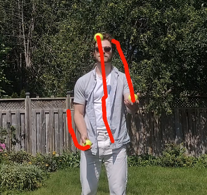
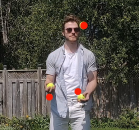
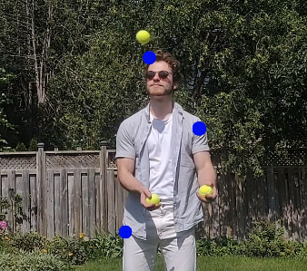
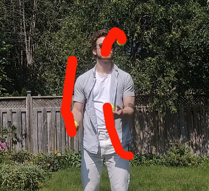
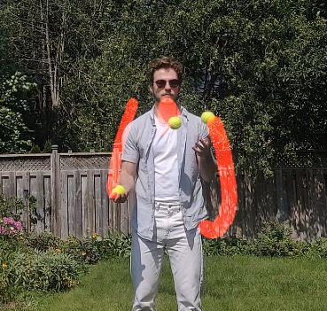
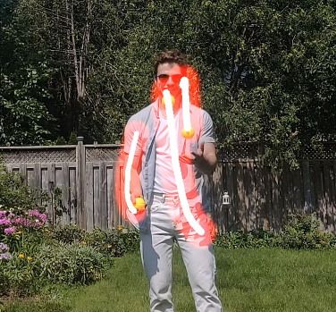
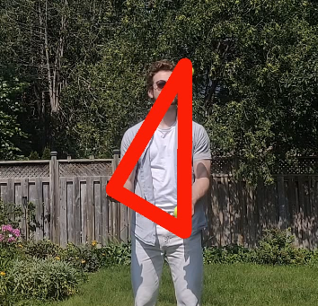
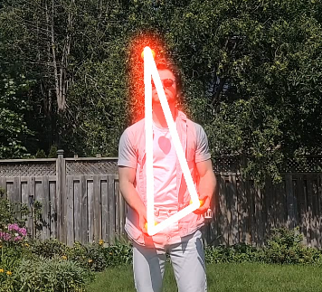

# Balltracking Gser Guide

## Detection

Currently, there are two supported detectors:
DETR - very accurate but quite slow
RN50 - faily accurate, some false positive, faster

## Tracking

There are two options for ball trackers, **Constant Velocity** and **Constant Acceleration**.
The Constant Velocity tracker generally outputs more smooth trajectories, but it's overall less accurate.
The Constant Acceleration tracker tracks objects closer, but at times extrapolates too far and makes sharp corrections.

Here's an example that illustrates the difference between the two:

|Constant Velocity|Constant Acceleration|
|---|---|
|||

## Effects

Here are all the effects listed. Note that not all effects take all arguments.
For example, The effect `fully_connected` doesn't change when the "length" attribute
is changed, because it doesn't have a fixed length.

|Effect Name|Example|Speed|
|---|---|---|
|dot||5/5|
|lagging_dot||5/5|
|line||5/5|
|highlight_line||2/5|
|neon_line||2/5|
|contrail||1/5|
|fully_connected||4/5|
|fully_connected_neon||4/5|
|debug||2/5|

## Best Practices:

1. Use a **high framerate**. Most cameras can shoot 60fps now, go as high as you can.
Every frame is additional information for the tracker, so it's better able to track the balls.
2. Use a **fast shutter speed**. This is usually implied by high framerate, but technically different.
A fast shutter speed will **reduce motion blur**, making the balls in every frame look more like balls 
and thus making them easier to detect.
3. Expose for the balls. If the exposure of the camera is too high or too low, the balls will lose detail
and they'll be almost impossible to detect, because they won't look like balls. Even lighting is best,
so the camera doesn't have to expose for the highlights or the shadows.
4. Use a **small file to test ideas**. Some of the effects and detections are very slow to run,
especially without a GPU. It's best to test and tweak an effect on a short clip, iterate fast, and then
apply it to a longer clip once you're sure you have what you want.
